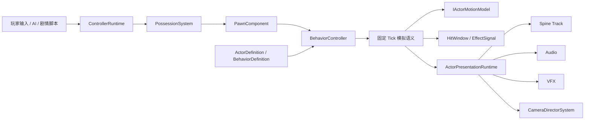

# GameplayObject 客户端架构

## 1. 当前交付范围

本阶段实现的是可运行的客户端纵切：Yefa 与 Slime 使用同一套控制权、固定 Tick 行为、运动、Spine 表现、命中查询和镜头请求框架。纯行为语义与 Unity 表现适配保持分层，后续可以在不修改行为核心的前提下增加飞行单位、载具、机关、编队切换或剧情控制器。

当前 Yefa 与 Slime 使用 `CombatActor` 纵切组合：`PropertyComponent`、`EffectComponent`、`SpineComponent`、`EventComponent`、`ActorAuthoringComponent`、`PawnComponent` 和一个运动模型。`GameplayObjectModuleCollection` 已提供更轻量对象组合的生命周期基础，但尚未接入 `ActorRuntimeLogic` 的正式创建路径；因此本阶段已验证的是角色与怪物复用，纯机关的按需模块组合仍是下一阶段工作，不能把当前 `CombatActor` 直接宣称为最终通用对象工厂。

## 2. 分层原则

- 控制层只产生 `ControlFrame`，不直接播放动画、移动 Transform 或结算伤害。
- 行为层只处理稳定 ID、Tick 区间、能力阻塞、命中窗口、运动片段和玩法事件。
- 运动层通过 `IActorMotionModel` 解释统一运动意图；CharacterController 只是当前客户端实现之一。
- 战斗层在固定 Tick 主动查询禁用的 Box、Sphere 或 Capsule Hitbox，先收集不可变命中结果，再在全体查询完成后发布已有 `EffectSignal`，不绕过属性、受击、血条和飘字链路。
- 表现层只消费行为相位；动画、音效、VFX 或镜头完成回调不能反向决定权威行为是否结束。

## 3. 资产职责

### ActorDefinition

保存对象稳定 ID、内容分类、阵营、默认能力、移动参数、运动模型、基础移动表现、行为列表和根运动绑定。资产只保存共享只读配置，不保存实例速度、连段或当前动画。

### ActorBehaviorDefinition

一个行为资产同时包含两类数据：

- `SimulationClips`：服务器可复用的固定 Tick 语义，例如 HitWindow、CapabilityBlock、GameplayEvent 和 Motion。
- `PresentationVariants`：客户端表现变体，例如同一普通攻击的 `Default` 与 `Moving` Spine 动画、音效、VFX 和镜头 Cue。

行为总时长、连携窗口和命中窗口都使用整数 Tick。表现 Cue 可以有多段 Spine 动画，并通过独立 Track 与当前行为句柄进行所有权清理。

### ActorAuthoringComponent

只负责 Prefab 场景引用：禁用的 BoxCollider、SphereCollider 或 CapsuleCollider，VFX 根对象、显式 FacingRoot、镜头目标和 ActorDefinition。每个 Hitbox 明确声明跟随自身 Transform 或相对 FacingRoot 镜像；跨资产关系使用稳定 ID，并由 Editor 校验器在进入运行时前检查闭环。

## 4. 固定 Tick 执行顺序

每个渲染帧先采集控制数据，再由累加器推进零到多个 60 Hz 模拟 Tick，最后执行一次表现插值：

1. `ControllerRuntime` 产生带 `PossessionGeneration` 的 `ControlFrame`。
2. `ActorControlFrameBuffer` 缓冲瞬时按钮，控制代数变化时丢弃旧控制者输入。
3. 全体 Actor 执行 Prepare：玩家控制、AI 或剧情控制器生成意图，朝向先落地，`BehaviorController` 推进相位，Motion 按实际 Q16 相位区间积分。
4. 全体 Actor 执行 Motion：`IActorMotionModel` 一次性应用控制位移和行为位移，所有对象随后共享同一个 Tick 的最终空间状态。
5. 全体 Actor 执行 Resolve：HitWindow 查询真实物理形状，只收集不可变 `EffectSignal`，不在查询回调中同步改写其他 Actor。
6. 全体 Actor 执行 Commit：按稳定 SimulationId 提交已收集信号；同 Tick 互击不会因先收到受击回调而取消尚未查询的攻击。
7. `EffectRuntime` 在同一个 Tick 的后置阶段推进持续时间、周期效果与触发冷却，卡帧补步和确定性单步不会再与墙钟时间分叉。
8. 表现层用 `BehaviorPhase + interpolationAlpha` 显式 Seek Spine 行为 Track；基础移动表现仅在行为通道空闲时运行。
9. `CameraDirectorSystem` 在 LateUpdate 解析最高优先级镜头请求，独立 CameraRig 跟随目标并保证唯一 AudioListener。

## 5. 控制权与上下文切换

Pawn 不判断自己由玩家、AI 还是剧情控制。`PossessionSystem` 使用控制租约和代数隔离上下文：

- 小队切换：释放当前角色租约，将同一个 PlayerController 接管目标 Pawn；旧角色可以立即交还 AIController。
- 骑车：PlayerController 从角色 Pawn 切换到 Vehicle Pawn，角色成为载具乘员表现或附属 Pawn。
- 剧情演出：高优先级 CutsceneController 临时接管 Pawn，结束时释放租约并恢复原控制器。
- 失控、眩晕或 UI 锁定：通过 Capability 阻塞 `Input`、`Move`、`Rotate` 或行为能力，不在输入脚本中增加上下文布尔值。

任何新控制来源都必须只输出 `ControlFrame`，不得直接调用角色内部移动或技能方法。

最终 `ControlFrame` 携带 `EffectiveScopes`。当剧情只接管 Facing、玩家只接管 Locomotion 时，运行时只覆写对应领域；EnemyAi 仍可驱动没有被租约接管的领域。GameplayKit 会成对保存和释放本地玩家租约与控制器，玩家回收或重建后可以复用稳定控制器编号，不遗留幽灵租约。

## 6. Spine、根运动与 Hitbox

Spine 动画是客户端表现资产，不是权威时钟。行为 Track 的自由时间推进被冻结，运行时每个表现帧使用权威 `BehaviorPhase` 显式采样。迁移工具将移动攻击的根骨骼轨迹离线采样为每个行为 Tick 的局部位移；运行时按照本次模拟跨越的 Q16 半开区间积分，只在匹配 Variant 上应用位移，并在 Spine `UpdateLocal` 抵消已经提取的 hips 平移。左右朝向、父骨缩放、RootMotionScale 和 Actor 出生旋转都在同一换算链中处理，因此服务器不需要加载 Spine 数据也能复现同一移动轨迹。

命中窗口属于行为模拟资产，Hitbox 形状属于 Prefab 绑定。当前客户端精确支持定向 Box、Sphere 与 Capsule 的 Unity Physics 主动查询；服务端接入物理引擎后应保留相同 HitWindow Tick、稳定 Hitbox ID、Facing 规则、阵营关系和一次窗口内目标去重规则，仅替换空间查询实现。

## 7. 扩展方式

### 飞行角色

新增 `ActorMotionModelDefinition` 与 `IActorMotionModel` 实现来解释三维移动、升降和悬停；新增对应控制器把升降意图编码进控制帧或扩展后的运动命令。行为、能力、镜头、战斗和表现层无需识别“飞行角色”类型。

### 载具

新增 Vehicle MotionModel 与 VehicleController，并让载具拥有独立 Pawn。上车、下车是控制租约与挂点表现变化，不应把 `isDriving` 分支写进角色移动核心。

### 三人小队

三个单位各自保留独立 Entity、Pawn、行为状态和冷却状态。切换系统只改变 PlayerController 的 Possession；镜头通过新的基础跟随请求切换 Subject，不重新创建角色运行时。

### 地图机关

机关可以只使用 Behavior、Capability、PresentationEvent、VFX 或自定义运动模块。没有战斗需求时不安装 Property/Effect/HitQuery；没有骨骼表现时不安装 Spine 适配器。类型分类只用于内容检索，不能成为运行时功能开关。

### 剧情模式

剧情系统通过 CutsceneController 和高优先级 CameraRequest 接管输入与镜头。剧情时间轴应发送稳定行为命令或表现事件，不能直接修改 BehaviorController 的内部 Tick。

## 8. 服务端迁移边界

可直接迁移或生成服务器数据的内容：

- 行为 ID、总 Tick、速率、连携窗口和行为优先级。
- Capability 位与阻塞区间。
- HitWindow、Hitbox ID、阵营掩码、伤害来源和 GameplayEvent。
- Motion ID 与离线烘焙的逐 Tick 位移。
- 控制帧协议、PossessionGeneration 和行为启动命令。

仅客户端保留的内容：

- Spine AnimationReferenceAsset、Track、混合时间和播放速度适配。
- AudioClip、VFX GameObject、CameraFollowProfile。
- Unity CharacterController、MonoBehaviour 场景引用和渲染插值。

服务端不应引用 `UnityEngine.Object` 或 ActorDefinition 本体。生产管线应把纯模拟字段导出成版本化 DTO，并对稳定 ID、TickRate 和烘焙数据计算内容版本；客户端与服务端握手时验证版本一致。

当前仍有三个明确的服务器/PVP 边界：正式运行时尚未从 GameplayKit 注入动态关系解析器，默认目标关系仍读取 ActorDefinition 的出生 Faction；每实例 TeamId、魅惑和动态同盟需要独立 CombatIdentity。`PropertyComponent.GetCalculatedDamage` 仍使用 `UnityEngine.Random`，生产服务器应把随机数注入战斗上下文或直接同步权威伤害结果。控制、行为、命中区间和 Motion 数据已经可导出，但 `ActorRuntimeLogic` 本身仍是 Unity 客户端组合器，不应直接复制到服务器。

## 9. 资产验收约束

- 每个对象、行为、Clip、Variant、Cue、Motion、Hitbox 和 VFX 都必须具有大小写敏感的稳定 ID。
- 每个行为必须包含 `Default` 表现变体；资源型 Cue 不允许缺失动画、音频、镜头配置或绑定 ID。
- HitWindow 必须声明有效 Effect 标签和目标阵营，Hitbox Collider 必须保持禁用。
- 行为结束、打断、死亡、切换控制者和对象释放都必须清理 Capability 句柄、Spine Track、镜头请求、命中去重集合和事件监听。
- 自动化测试验证纯逻辑与资产关系；Play Mode 还必须观察实例创建、实际移动、动画、伤害、血条、飘字和镜头跟随。
