# Path to Prometheus：ELC 与四大系统业务流程说明

> 本文面向策划、玩法、技术美术和需要理解运行时行为的开发者。内容只讲设计思想、配置方式和业务流程，不要求读者阅读具体代码。

## 1. 先建立一个业务视角

在 Prometheus 中，一个角色不是一张“脚本列表”，而是一个可以被系统管理的业务对象。以 Yefa 为例：

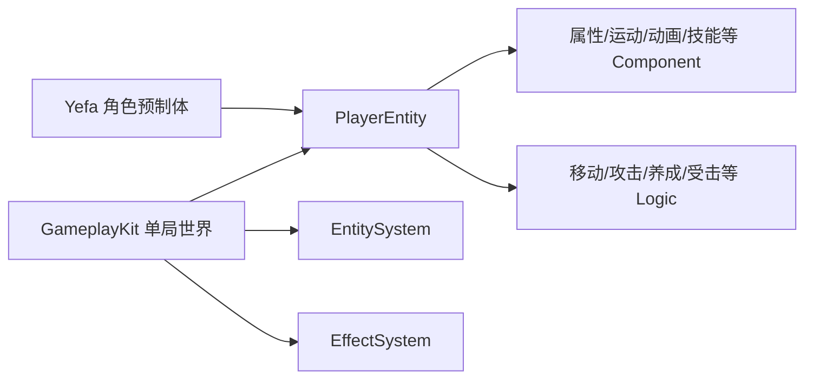

预制体提供角色的外观、动画、碰撞体和基础配置；`PlayerEntity` 把这些能力组合成一个具有统一生命周期的角色；Logic 决定角色在当前条件下做什么；单局 System 负责所有角色共享的规则和服务。

ELC 的核心思想是：

- **Entity 是业务对象**：例如“当前这一个 Yefa”。
- **Component 是业务数据和能力入口**：例如“Yefa 的攻击力、动画库、技能冷却和移动状态”。
- **Logic 是业务行为**：例如“Yefa 收到普通攻击输入后开始攻击流程”。
- **System 是跨对象流程**：例如“本局所有角色的 Effect 统一结算”。

## 2. Yefa 如何成为一个可玩的角色

### 2.1 配置阶段

Yefa 的角色预制体通常需要配置属性、运动、Spine、攻击、技能、特效和 Effect 接入等内容。运行时不会把资源加载逻辑塞进 Entity，而是由玩法入口先创建场景对象，再交给 Entity 组合。

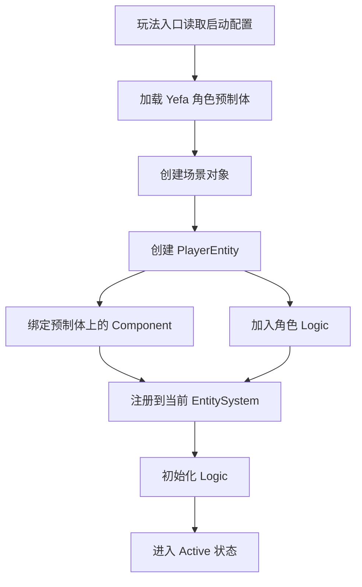

业务上可以把这个过程理解为：**预制体定义“角色有什么”，Entity 定义“这些东西属于同一个角色”，Logic 定义“角色如何行动”。**

### 2.2 一帧中的角色行为

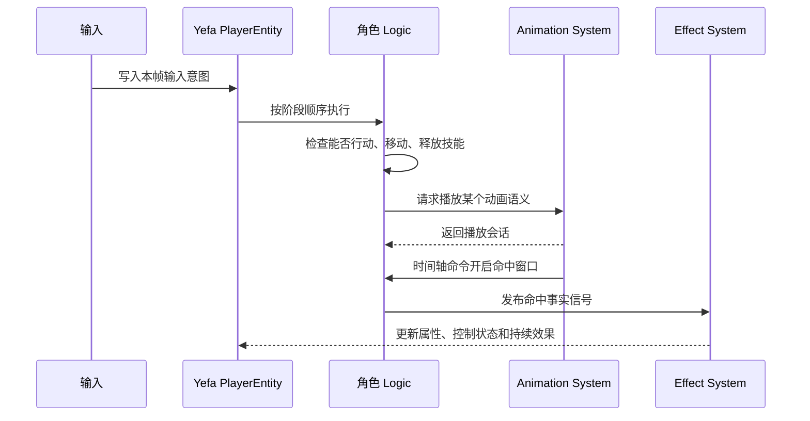

例如 Yefa 同时按下多个动作键时，输入不会直接播放四个动画。不同动作 Logic 会按既定顺序提出请求，Animation System 再根据动作优先级仲裁。最终只有获得动画轨道所有权的动作继续执行。

### 2.3 为什么要把养成也纳入 ELC

Yefa 的等级、装备、武器和天赋不是直接把最终数值写死在角色身上，而是通过各自 Logic 将成长结果投影为角色独占的持续 Effect。这样，等级加攻击、装备加倍率、天赋提升技能系数都能走同一套可回滚流程。

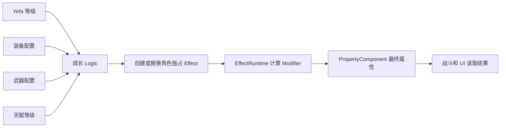

这使业务规则形成统一语言：临时 Buff、永久成长、装备效果和战斗控制都可以被追踪、移除和回滚。

---

## 3. Animation System：如何给一个角色配置动画行为轴

### 3.1 业务目标

动画配置不是单纯把 Spine 动画名称填进表格，而是把一条动画变成可被玩法消费的“行为轴”。一条行为轴至少回答四个问题：

1. 它代表什么稳定玩法语义？
2. 它在什么时候触发什么事件或命令？
3. 它能否循环、被谁打断、优先级是多少？
4. 动画结束或被打断后，玩法状态如何清理？

### 3.2 从 Spine 资源到 AnimationLine

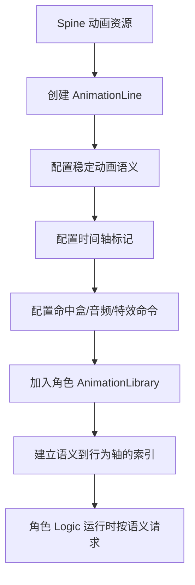

例如给 Yefa 配置一段普通攻击：

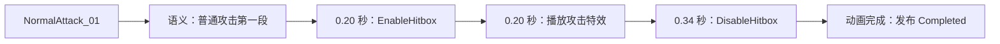

业务人员不需要让 Logic 记住具体 Spine 动画名。Logic 只请求“普通攻击第一段”，Yefa 的 AnimationLibrary 负责找到对应 AnimationLine。另一个角色可以使用相同语义，但映射到完全不同的资源和时间轴。

### 3.3 配置如何在运行时执行

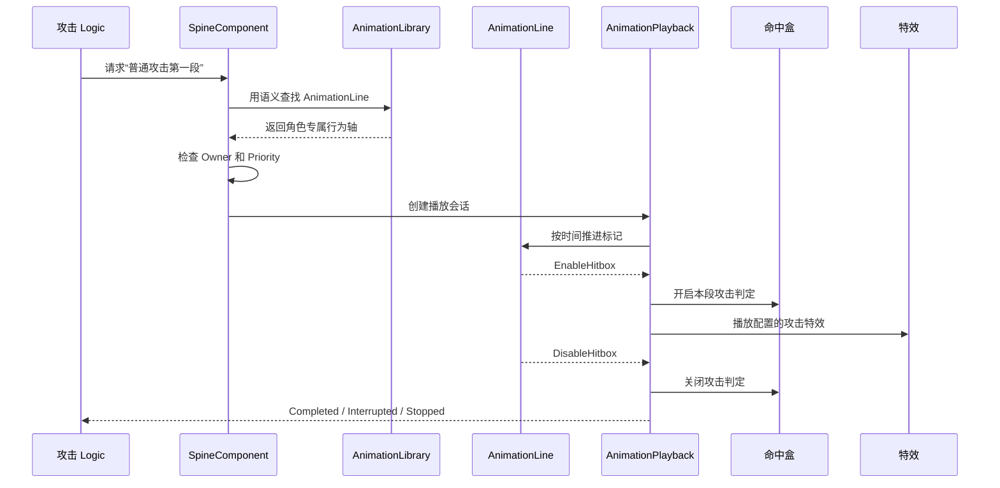

### 3.4 动画优先级的业务含义

动画优先级不是美术排序，而是动作控制规则。例如：

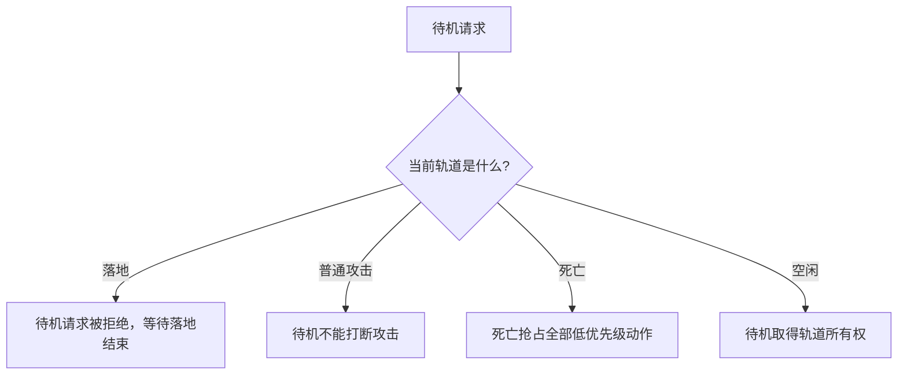

- 待机、移动是低优先级循环行为。
- 攻击、闪避、技能和大招逐渐提高优先级。
- 受击和死亡拥有更强的抢占能力。
- 每个 Logic 只能停止自己拥有的动画，避免移动 Logic 误停技能动画。

### 3.5 行为轴的设计原则

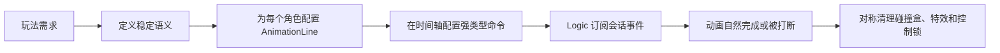

动画可以发出“开启命中盒”这样的时间事实，但动画本身不负责结算伤害。伤害由碰撞命中后产生的 EffectSignal 完成。这样同一套动画轴可以服务不同数值配置，也不会让美术事件直接改变战斗结果。

---

## 4. Effect System：从配置到战斗结果

### 4.1 Effect 的业务模型

一个 Effect 可以理解为一份“可复用的战斗规则定义”。它描述持续时间、周期、层数、触发条件和原子操作；运行时则为具体目标创建独立实例。

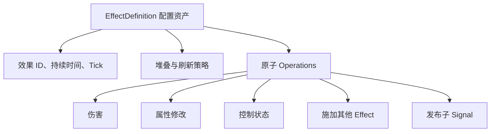

常见业务配置可以包括：

- **即时伤害**：命中后立即计算并扣除目标生命。
- **燃烧**：持续若干秒，每个 Tick 造成火焰伤害。
- **战意**：叠层提高攻击力或攻速，并刷新持续时间。
- **眩晕**：通过控制状态禁止行动和移动，移除时自动恢复。
- **成长 Effect**：不显示在 Buff 列表中，但持续投影等级、装备和天赋结果。

### 4.2 从事实信号到 Effect

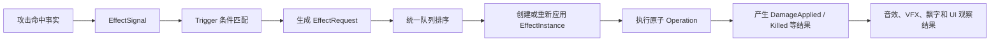

攻击 Logic 不需要知道“命中后是否燃烧、是否叠战意、是否触发眩晕”。它只发布命中事实。业务规则由 Trigger 配置决定，效果定义决定具体操作，表现系统只观察最终结果。

### 4.3 重点：EffectRuntime 的原子事务

EffectRuntime 最重要的设计之一，是所有信号和效果请求都进入同一个同步事务。事务的目标不是数据库意义上的回滚，而是保证一条因果链在统一、有序、可限制的队列中完成处理。

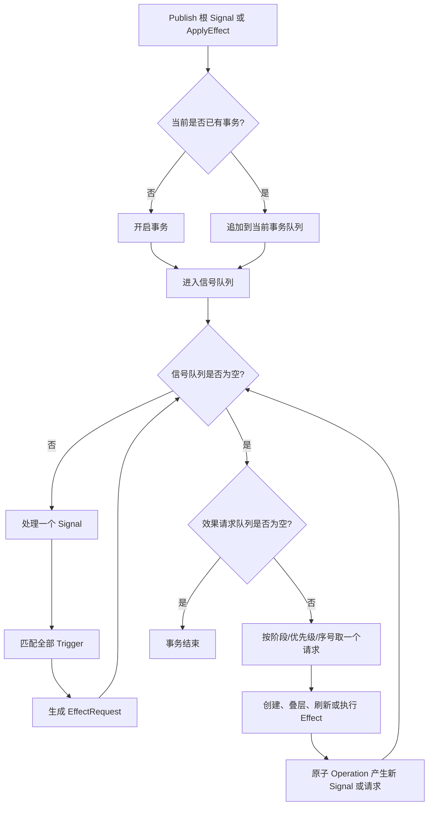

“原子”的业务意义有三点：

1. **不在 Operation 内部直接递归执行**：Operation 只追加请求或子信号，真正执行回到统一队列。
2. **新信号优先处理**：新产生的事实先完成 Trigger 路由，再执行待处理的效果请求。
3. **每一步都有统一顺序**：效果阶段、优先级和插入序号共同决定稳定执行顺序。

因此，一个命中同时触发直接伤害、燃烧和战意时，不是三个脚本互相调用，而是形成一条可追踪的事务链。

### 4.4 链式 Effect 如何工作

例如“火焰命中 -> 直接火伤 -> 伤害结果为火属性 -> 追加燃烧”的业务流程：

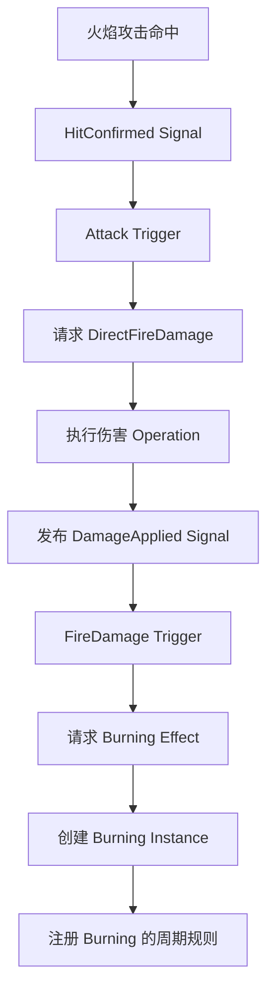

其中每一跳都保留：

- `Caster`：直接释放当前效果的实体。
- `Source`：整条因果链的最初来源。
- `SignalChainId`：这条链的唯一编号。
- `ChainDepth`：当前信号距离根信号的深度。

这让系统可以区分“谁直接造成了这一跳效果”和“整条效果链最初来自谁”。

### 4.5 循环 Effect 如何被控制

链式触发可能形成循环，例如：

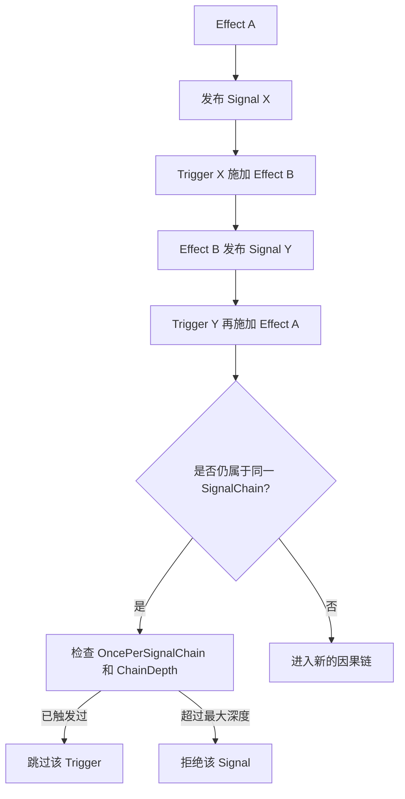

系统提供多层保护：

- **同链去重**：配置为 `OncePerSignalChain` 的 Trigger，在同一个 SignalChainId 内只触发一次。
- **链深度上限**：当子信号超过允许深度时停止继续传播。
- **事务命令上限**：单次事务处理的信号和请求数量超过预算时清空队列并终止事务。
- **统一队列而非栈式递归**：循环不会不断消耗调用栈，而是在队列中被识别和限制。

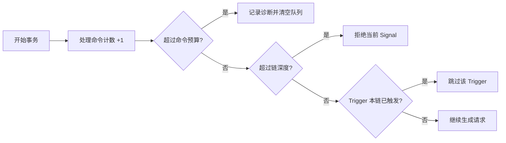

这里的“终止”只针对失控的当前因果链或当前事务，不会因为一个表现观察者异常而破坏其他正常结算。结果信号的观察者是只读消费者，音效或特效模块出错不会回头改变已经完成的伤害。

### 4.6 持续 Effect 的运行时流程

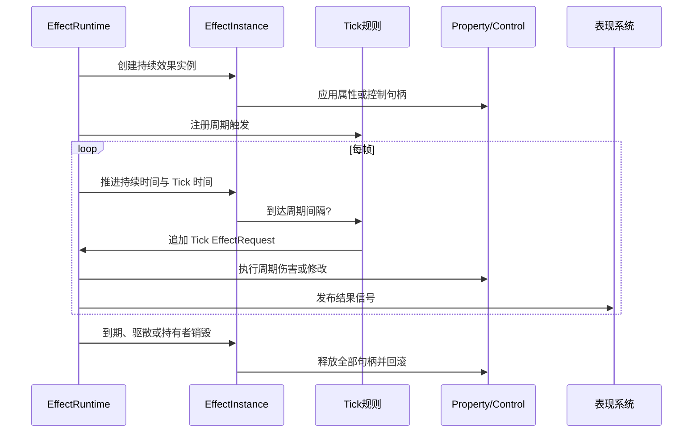

重复施加时，系统分别判断“是否刷新持续时间”和“是否改变层数”。刷新时间不会破坏已有的周期 Tick 进度；达到最大层数时仍可只刷新持续时间。EffectInstance 被移除时，属性 Modifier、控制状态和由该实例注册的 Trigger 一起释放。

---

## 5. AiSystem：史莱姆 AI 如何配置和运行

### 5.1 业务配置分层

史莱姆 AI 不是把行为写死在某个预制体脚本里，而是用一份 Enemy AI Definition 描述状态图，再由每只史莱姆拥有自己的 Brain。

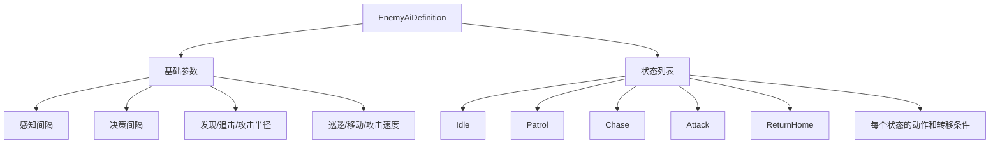

状态配置由三部分组成：

- **Enter Actions**：进入状态时做一次，例如播放待机、选择巡逻点、清空目标。
- **Tick Actions**：状态持续期间执行，例如向目标移动、面向目标、推进攻击。
- **Exit Actions**：离开状态时清理，例如停止移动或取消攻击。

### 5.2 史莱姆的典型状态流程

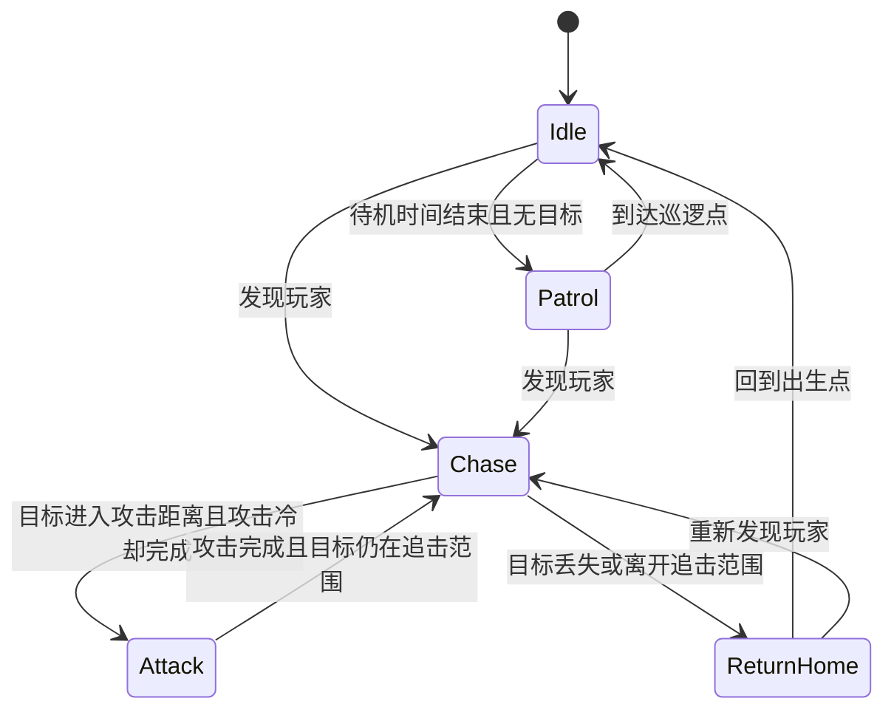

实际项目中的状态并不直接写死在 Brain 内，而是由资产中的状态 ID、动作、条件和优先级组合而成。这样可以在不改动通用决策运行时的情况下，为另一类敌人配置不同状态。

### 5.3 史莱姆发现玩家的业务流程

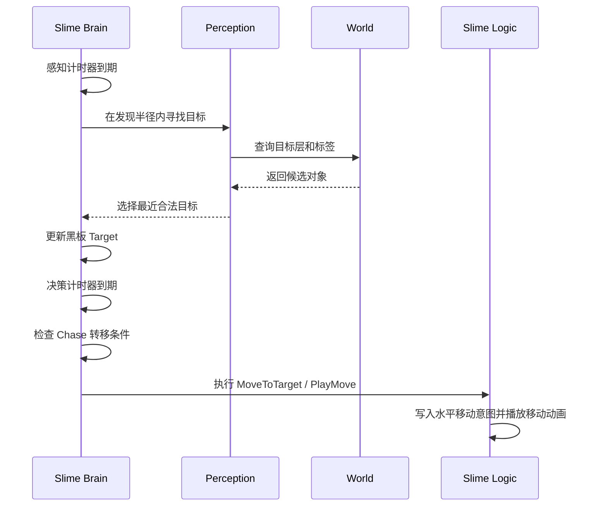

感知和决策使用不同间隔：感知不需要每帧查询物理世界，决策也不需要每帧扫描全部转移条件。这样既降低成本，也让“感知频率”和“行为反应速度”成为可以独立调参的业务参数。

### 5.4 史莱姆攻击流程

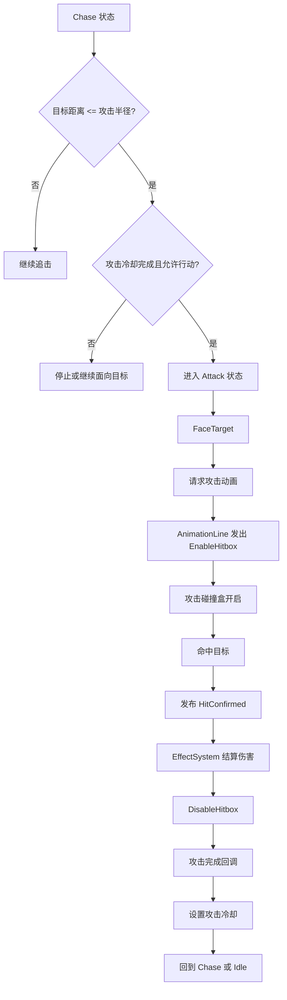

AI 不直接计算最终伤害，也不直接操作目标生命。AI 只负责决定“现在尝试攻击”；动画负责提供命中窗口；碰撞负责确认是否命中；EffectSystem 负责结算结果。

### 5.5 受击、眩晕和死亡时如何处理

```mermaid
flowchart LR
    A[受击或控制效果] --> B[PropertyComponent 控制状态变化]
    B --> C[Entity Logic 行动门禁]
    C --> D[AI Logic 暂停 Brain]
    D --> E[停止水平移动和攻击窗口]
    E --> F[保留状态、目标和冷却]
    F --> G[控制结束]
    G --> H[Brain Resume]
    H --> I[重放当前状态进入动作]
```

死亡是不可恢复的生命周期事件：

```mermaid
flowchart TD
    A[死亡事实] --> B[AI Logic 标记 Dead]
    B --> C[永久停止 Brain]
    C --> D[停止移动和攻击判定]
    D --> E[死亡动画取得高优先级轨道]
    E --> F[Effect/表现完成清理]
    F --> G[EntitySystem 安全回收史莱姆 Entity]
```

这套设计避免了“受击时手工关闭一堆 AI 标志”或“死亡动画被 AI 待机重新覆盖”的问题。控制状态由 Effect 管理，Logic 根据能力门禁决定是否运行，死亡则由 Entity 生命周期完成最终收束。

---

## 6. 四个系统组成的完整业务闭环

```mermaid
flowchart TD
    A[玩家输入或 AI 决策] --> B[Entity/Logic 形成动作意图]
    B --> C[Animation System 播放行为轴]
    C --> D[时间轴命令开启有效窗口]
    D --> E[碰撞或规则确认事实]
    E --> F[Effect System 处理 Signal]
    F --> G[原子事务执行链式和持续 Effect]
    G --> H[发布最终结果 Signal]
    H --> I[属性、控制、UI、VFX、音频更新]
    I --> J[EntitySystem 继续调度或安全回收]
    J --> A
```

从业务角度看，四个系统各自回答不同问题：

| 系统 | 业务问题 | 主要产物 |
| --- | --- | --- |
| Entity System | 这个对象是否存在，何时更新，何时退出？ | Entity 生命周期与调度 |
| Animation System | 这个动作如何表现，何时产生有效窗口？ | 动画会话与时间轴命令 |
| Effect System | 事实发生后，数值和状态如何结算？ | EffectInstance 与结果 Signal |
| AI System | 当前敌人想做什么，为什么切换状态？ | 状态、黑板与动作意图 |

## 7. 业务配置时应遵守的原则

```mermaid
flowchart LR
    A[共享配置] --> B[运行时实例]
    B --> C[明确所有者]
    C --> D[产生事实]
    D --> E[统一规则处理]
    E --> F[结果供表现观察]
    F --> G[生命周期结束时对称释放]
```

1. **共享配置只描述规则，不保存某个角色的运行状态。**
2. **动画只发布时间事实，不直接决定最终伤害。**
3. **攻击和 AI 发布事实或动作意图，不绕过 EffectSystem 修改结果。**
4. **链式 Effect 通过队列进入事务，不在操作内部直接递归调用。**
5. **持续效果必须拥有明确实例和资源句柄，结束时能够回滚。**
6. **控制、受击和死亡优先通过统一门禁与生命周期表达。**
7. **任何注册、监听、动画会话和效果实例都要有对应的释放路径。**

## 8. 一句话总结

Prometheus 的 ELC 把角色、动画、效果和 AI 组织成一条清晰的业务流水线：**Entity 负责承载对象，Logic 负责提出行为，Animation 负责定义行为发生的时间，Effect 负责把事实结算为结果，AI 负责在规则允许的范围内决定下一步行为。**

这种设计的价值不只是代码解耦，更重要的是让策划配置、程序实现、美术时间轴和运行时结果之间存在一条可解释、可追踪、可扩展的业务流程。
