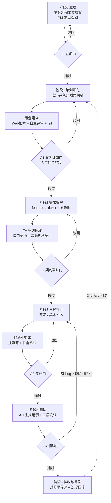
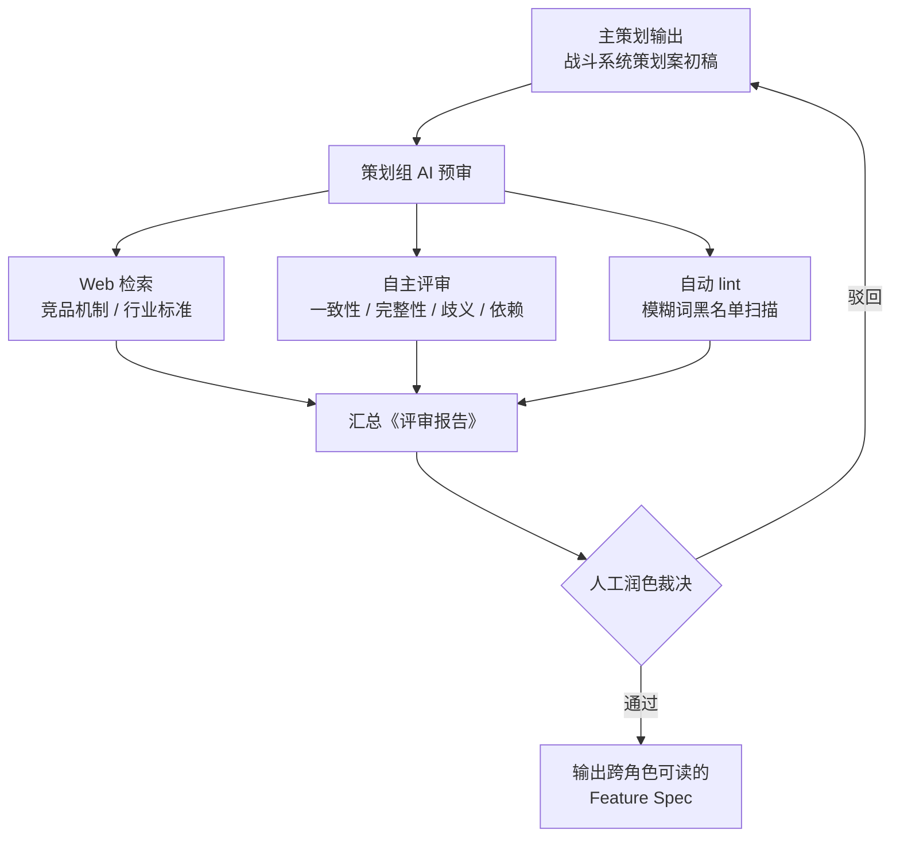
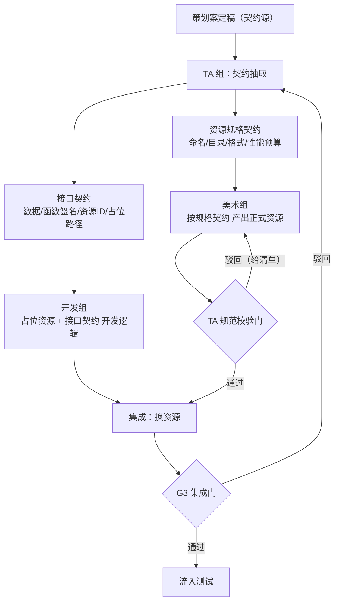
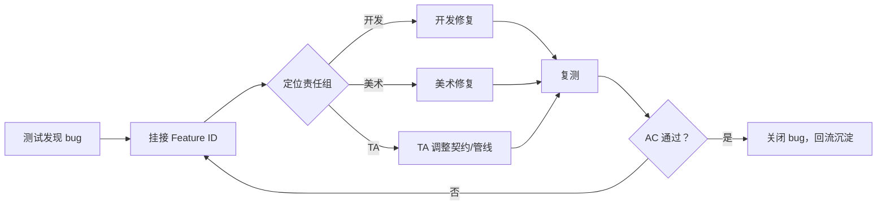
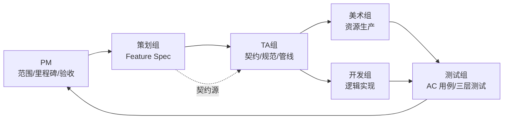

# 工作流流程图

> 以下流程图为 Mermaid 语法，可在支持 Mermaid 的 Markdown 工具（Typora / Obsidian / VS Code 插件 / GitLab）中直接渲染。

---

## 一、端到端总流程图

---

## 二、阶段 1 策划细化（G1 门）详细图

---

## 三、阶段 3 三线并行详细图

---

## 四、缺陷回环图（G4 门）

---

## 五、六节点协作关系图

